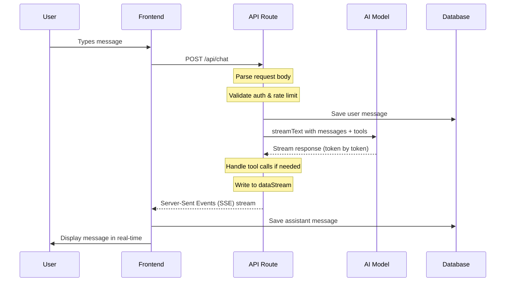

# Project Structure & Streaming Flow Explanation

## 📁 Directory Structure

```
amogaixhatv6/
├── app/                          # Next.js App Router
│   ├── (auth)/                   # Authentication routes
│   │   ├── login/
│   │   ├── register/
│   │   └── api/auth/            # Auth API endpoints
│   │
│   ├── (chat)/                  # Chat routes (main UI)
│   │   ├── chat/[id]/          # Individual chat page
│   │   ├── api/chat/            # Chat API endpoints
│   │   │   ├── route.ts         # POST/DELETE chat
│   │   │   └── [id]/stream/    # Streaming endpoint
│   │   └── page.tsx            # Chat list page
│   │
│   └── layout.tsx               # Root layout
│
├── lib/                         # Core library code
│   ├── ai/                     # AI-related code
│   │   ├── tools/              # AI tools (getWeather, getValue, etc.)
│   │   │   ├── get-weather.ts
│   │   │   ├── get-value.ts
│   │   │   ├── create-document.ts
│   │   │   └── update-document.ts
│   │   ├── prompts.ts          # System prompts
│   │   ├── providers.ts        # AI model providers
│   │   └── models.ts           # Model configurations
│   │
│   ├── db/                     # Database layer
│   │   ├── schema.ts           # Drizzle ORM schema
│   │   ├── queries.ts          # DB queries
│   │   └── migrations/         # SQL migrations
│   │
│   ├── artifacts/              # Document/Artifact handling
│   │   └── server.ts           # Artifact handlers
│   │
│   ├── types.ts                # TypeScript types
│   └── utils.ts                # Utility functions
│
├── components/                 # React components
│   ├── chat.tsx               # Main chat component
│   ├── message.tsx            # Message component
│   ├── multimodal-input.tsx   # Input with attachments
│   ├── artifact.tsx           # Artifact/document panel
│   └── ui/                    # UI components (buttons, dialogs, etc.)
│
└── hooks/                     # React hooks
    └── use-messages.tsx       # Message management hook
```

---

## 🔄 Streaming Flow (How Chat Works)

### Step-by-Step Flow:



---

## 📡 API Endpoint: `app/(chat)/api/chat/route.ts`

This is the **main chat endpoint** - where all the magic happens.

### Request Flow:

```typescript
// 1. RECEIVE REQUEST
export async function POST(request: Request) {
  const requestBody = await request.json();  // { id, message, messages, ... }
  
  // 2. VALIDATE AUTH
  const session = await auth();
  if (!session?.user) {
    return new ChatbotError("unauthorized").toResponse();
  }
  
  // 3. CHECK RATE LIMIT
  const messageCount = await getMessageCountByUserId(...);
  if (messageCount > entitlements.maxMessagesPerDay) {
    return new ChatbotError("rate_limit").toResponse();
  }
  
  // 4. GET/CREATE CHAT
  const chat = await getChatById({ id });
  if (!chat) {
    await saveChat({ id, userId, title: "New chat", visibility });
  }
  
  // 5. GET EXISTING MESSAGES
  const messagesFromDb = await getMessagesByChatId({ id });
  
  // 6. CREATE AI STREAM
  const stream = createUIMessageStream({
    execute: async ({ writer: dataStream }) => {
      const result = streamText({
        model: getLanguageModel(selectedChatModel),
        system: systemPrompt({ ... }),
        messages: modelMessages,
        tools: {
          getWeather,
          getValue,
          createDocument,
          updateDocument,
          requestSuggestions,
        },
      });
      
      // 7. MERGE AI STREAM TO DATA STREAM
      dataStream.merge(result.toUIMessageStream());
    },
    onFinish: async ({ messages }) => {
      // 8. SAVE MESSAGES TO DB
      await saveMessages({ messages: finishedMessages });
    },
  });
  
  // 9. RETURN SSE RESPONSE
  return createUIMessageStreamResponse({ stream });
}
```

---

## 🛠️ Tool Structure (How Tools Work)

### Creating a Tool:

```typescript
// lib/ai/tools/get-weather.ts
import { tool } from "ai";
import { z } from "zod";

export const getWeather = tool({
  description: "Get the current weather at a location",
  
  // Input validation schema (Zod)
  inputSchema: z.object({
    city: z.string().optional(),
    latitude: z.number().optional(),
    longitude: z.number().optional(),
  }),
  
  needsApproval: true,  // Show approval dialog before executing
  
  // Execute function - runs on server
  execute: async (input) => {
    // Fetch data from external API
    const response = await fetch(`https://api.weather.com/...`);
    const weatherData = await response.json();
    
    return weatherData;  // Return to AI model
  },
});
```

### Registering Tools:

```typescript
// In route.ts
const result = streamText({
  model: getLanguageModel(selectedChatModel),
  system: systemPrompt({ ... }),
  messages: modelMessages,
  tools: {
    getWeather,        // ← Register tool here
    getValue,          // ← Register tool here
    createDocument,   // ← Register tool here
    // ... more tools
  },
});
```

---

## 📊 Data Stream (How UI Updates Work)

The project uses a **dataStream** to send custom data to the frontend:

```typescript
// Writing custom data to frontend
dataStream.write({ 
  type: "data-kind", 
  data: kind 
});

dataStream.write({ 
  type: "data-title", 
  data: title 
});

dataStream.write({ 
  type: "data-clear", 
  data: null 
});

dataStream.write({ 
  type: "data-finish", 
  data: null 
});
```

### Frontend Handles These Types:

```typescript
// In components/message.tsx or similar
switch (type) {
  case "data-kind":
    // Show artifact panel
  case "data-title":
    // Update title
  case "data-clear":
    // Clear content
  case "data-finish":
    // Mark as finished
  case "data-chat-title":
    // Update chat title
}
```

---

## 🗄️ Database Schema

```typescript
// lib/db/schema.ts

// Users
user: {
  id: uuid,
  email: string,
  password: string,
}

// Chats
chat: {
  id: uuid,
  createdAt: timestamp,
  title: string,
  userId: uuid (FK → user.id),
  visibility: "public" | "private",
}

// Messages
message: {
  id: uuid,
  chatId: uuid (FK → chat.id),
  role: "user" | "assistant",
  parts: json,        // Message parts (text, tool calls, etc.)
  attachments: json,
  createdAt: timestamp,
}

// Documents (Artifacts)
document: {
  id: uuid,
  title: string,
  content: text,
  kind: "text" | "code" | "image" | "sheet",
  userId: uuid (FK → user.id),
}
```

---

## 🔑 Key Files to Understand

| File | Purpose |
|------|---------|
| `app/(chat)/api/chat/route.ts` | Main chat API endpoint |
| `lib/ai/tools/*.ts` | Tool definitions |
| `lib/ai/prompts.ts` | System prompts |
| `lib/ai/providers.ts` | AI model provider setup |
| `lib/types.ts` | TypeScript types |
| `components/chat.tsx` | Main chat UI component |
| `components/message.tsx` | Message display component |
| `components/artifact.tsx` | Document editing panel |

---

## ➕ Adding New Tools

To add a new tool (like WooCommerce):

1. **Create tool file**: `lib/ai/tools/my-tool.ts`
2. **Define tool**: Use `tool()` from "ai"
3. **Register in route**: Add to `tools` object in `route.ts`
4. **Update types**: Add to `lib/types.ts` if needed

```typescript
// Example: lib/ai/tools/my-tool.ts
import { tool } from "ai";
import { z } from "zod";

export const myTool = tool({
  description: "What this tool does",
  inputSchema: z.object({
    param1: z.string(),
  }),
  execute: async ({ param1 }) => {
    // Do something
    return { result: "success" };
  },
});
```

```typescript
// In route.ts
tools: {
  getWeather,
  getValue,
  myTool,  // ← Add here
}
```

---

## Questions?

If you need clarification on any part, let me know!
